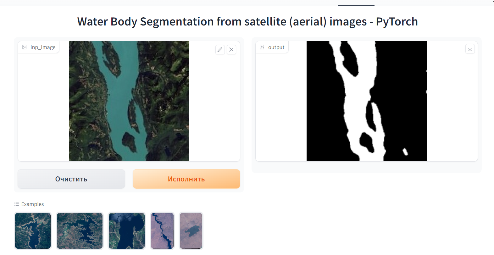

# Segmentation of water bodies on satellite (aerial) images with U-Net

В репозитории содержится код для обучения и развертывания модели U-Net для сегментации водоемов на спутниковых снимках. Модель обучалась на датасете [Satellite Images of Water Bodies](https://www.kaggle.com/datasets/franciscoescobar/satellite-images-of-water-bodies) с Kaggle.

Использованный стек:
- [PyTorch](https://github.com/pytorch/pytorch) (в частности [Segmentation Models](https://github.com/qubvel/segmentation_models.pytorch))
- [Albumentations](https://github.com/albumentations-team/albumentations)
- [Gradio](https://github.com/gradio-app/gradio)

Посмотреть на работу модели и сегментировать водоемы на спутниковых изображених можно на [Hugging Face Spaces](https://huggingface.co/spaces/anaaaiva/aerial-water-segmentation)

